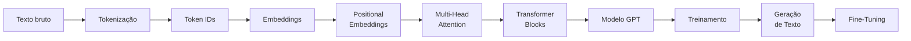

# MegaBrain — Construção de um Large Language Model *From Scratch*

Projeto Integrador da disciplina de **Inteligência Artificial e Sistemas Inteligentes**, do curso de
**Engenharia de Computação** da **Universidade do Oeste de Santa Catarina (UNOESC)** — Campus de Joaçaba.

| | |
|---|---|
| **Componente curricular** | Inteligência Artificial e Sistemas Inteligentes |
| **Professor** | Kleyton Hoffmann |
| **Período letivo** | 2026/2 |
| **Avaliação** | Compõe a nota A1/1 do componente |
| **Referência principal** | RASCHKA, Sebastian. *Build a Large Language Model (From Scratch)*. Manning Publications |

---

## Sobre o projeto

Este repositório acompanha a construção **incremental e do zero** de um Large Language Model (LLM)
baseado na arquitetura *Transformer*, ao longo de todo o semestre letivo.

A premissa central do projeto é **não utilizar modelos prontos nem serviços de API**. Em vez de
consumir um LLM já treinado, cada componente computacional do modelo é implementado, testado e
analisado individualmente — do tokenizador até o laço de treinamento — de modo que o funcionamento
interno de um modelo generativo deixe de ser uma caixa-preta.

O objetivo **não** é produzir um modelo competitivo com sistemas comerciais de larga escala. O modelo
final terá dimensões compatíveis com os recursos computacionais disponíveis, e o valor da entrega está
na compreensão arquitetural, na qualidade da implementação, na experimentação conduzida e na análise
crítica dos resultados obtidos.

O projeto é desenvolvido em dupla, mas parte das avaliações (quizzes e arguição) ocorre individualmente.

### Equipe

| Integrante | GitHub |
|---|---|
| Davy Josias Scheuermann | [@Davyjosias01](https://github.com/Davyjosias01) |
| _(preencher o segundo integrante da dupla)_ | |

---

## Objetivos

### Objetivo geral

Compreender os fundamentos computacionais dos modelos de linguagem por meio da implementação
incremental dos principais componentes de uma arquitetura baseada em Transformer.

### Objetivos específicos

Ao final do projeto, espera-se ser capaz de:

- compreender o fluxo completo de desenvolvimento de um modelo de linguagem;
- implementar mecanismos de tokenização e preparação de dados textuais;
- compreender e implementar representações vetoriais e *embeddings*;
- implementar mecanismos de atenção e *self-attention*;
- compreender a arquitetura Transformer utilizada em modelos GPT;
- implementar os principais componentes de uma arquitetura GPT;
- compreender o processo de treinamento de um modelo de linguagem;
- analisar funções de perda e o comportamento do treinamento;
- realizar geração de texto utilizando o modelo desenvolvido;
- compreender estratégias de uso de modelos pré-treinados e *fine-tuning*;
- analisar criticamente resultados, limitações e comportamento do modelo desenvolvido.

---

## Pipeline que será construído

Cada sprint acrescenta uma etapa ao pipeline abaixo, e os componentes das etapas anteriores são
reaproveitados e integrados às seguintes. Ao final, todo o caminho estará implementado neste repositório.



---

## Metodologia de desenvolvimento

Toda sprint segue o mesmo ciclo de trabalho, definido pelo componente curricular:

**Leitura → Glossário → Quiz → Implementação → Experimentação → Análise**

1. **Leitura orientada** — leitura prévia dos capítulos indicados, priorizando a compreensão dos
   conceitos, da arquitetura dos algoritmos e das relações entre os componentes do modelo.
2. **Glossário técnico** — registro cumulativo dos termos introduzidos no capítulo. O glossário não é
   uma tradução: cada entrada descreve o significado do termo e sua **função dentro do modelo de
   linguagem**. Detalhes do formato em [`technical-glossary/`](technical-glossary/).
3. **Quiz** — avaliação individual e periódica de compreensão conceitual, podendo cobrir conceitos,
   interpretação de código, parâmetros e operações matemáticas.
4. **Implementação** — atividade prática correspondente ao capítulo. A reprodução literal do código do
   livro ou de repositórios públicos não caracteriza o desenvolvimento da atividade; a implementação
   deve demonstrar domínio dos conceitos.
5. **Experimentação** — variação de parâmetros, configurações ou dados, para observar o impacto sobre
   comportamento, desempenho ou custo computacional.
6. **Análise dos resultados** — interpretação técnica dos resultados, relacionando-os aos conceitos
   estudados. Gráficos e números isolados, sem discussão, não bastam.

---

## Estrutura do repositório

| Diretório | Conteúdo |
|---|---|
| [`src/`](src/) | Código-fonte dos componentes do LLM (tokenizador, embeddings, atenção, blocos Transformer, modelo GPT, treinamento) |
| [`notebook/`](notebook/) | Notebooks Jupyter de exploração, demonstração e visualização de cada etapa |
| [`technical-glossary/`](technical-glossary/) | Glossário técnico cumulativo, organizado por capítulo |
| [`documentation/`](documentation/) | Material de referência: livro-texto, descrição do projeto e documentos de apoio |
| [`experiments/`](experiments/) | Experimentos de variação de parâmetros, configurações e dados |
| [`reports/`](reports/) | Relatórios técnicos com a análise dos resultados de cada sprint |
| [`results-by-sprints/`](results-by-sprints/) | Artefatos produzidos em cada sprint: métricas, gráficos, logs e saídas dos modelos |

Cada diretório possui seu próprio `README.md` descrevendo seu propósito e as convenções de organização.

---

## Ambiente de desenvolvimento

### Requisitos

- **Python 3.10 ou superior** (o ambiente atual utiliza Python 3.14.5)
- **Git**
- **PyTorch 2.x** — biblioteca central do projeto
- GPU NVIDIA com CUDA é opcional, mas acelera significativamente as sprints de treinamento

### Instalação

Clone o repositório e crie um ambiente virtual isolado:

```bash
git clone https://github.com/Davyjosias01/MegaBrain.git
```

**Windows (PowerShell):**

```bash
python -m venv .venv; .\.venv\Scripts\Activate.ps1
```

**Linux / macOS:**

```bash
python3 -m venv .venv && source .venv/bin/activate
```

Com o ambiente ativo, instale as dependências:

```bash
pip install -r requirements.txt
```

O arquivo `requirements.txt` instala a build de PyTorch com suporte a **CUDA 12.6**. Em máquinas sem
GPU NVIDIA, troque o índice do PyTorch pela build de CPU:

```bash
pip install torch --index-url https://download.pytorch.org/whl/cpu
```

### Validação do ambiente

O script abaixo confere a versão do Python, a versão do PyTorch, a disponibilidade de CUDA e executa
uma operação com tensores e uma passagem de *autograd*:

```bash
python src/verificar_ambiente.py
```

Se todas as verificações forem aprovadas, o ambiente está pronto para as próximas sprints.

---

## Cronograma

| Data | Sprint | Capítulo | Atividades |
|---|---|---|---|
| 30/07 | Sprint 0 | Preparação | Apresentação do projeto, organização dos grupos, instalação do ambiente (Python, Git, PyTorch) e estruturação do repositório |
| 06/08 | Sprint 1 | Cap. 1 | Introdução aos LLMs. Leitura orientada, glossário, Quiz 1 e mapa conceitual da arquitetura GPT |
| 13/08 | Sprint 1 | Cap. 1 | Discussão técnica, apresentação dos conceitos fundamentais e entrega da Sprint 1 |
| 20/08 | Sprint 2 | Cap. 2 | Tokenização, vocabulário, Token IDs e preparação dos conjuntos de dados |
| 27/08 | Sprint 2 | Cap. 2 | Embeddings, Positional Embeddings, DataLoader, experimentos e entrega da Sprint 2 |
| 03/09 | Sprint 3 | Cap. 3 | Introdução aos mecanismos de *attention* e implementação de *self-attention* |
| 10/09 | Sprint 3 | Cap. 3 | Scaled Dot-Product Attention, Causal Attention e experimentação |
| 17/09 | Sprint 3 | Cap. 3 | Multi-Head Attention, experimentos comparativos e documentação técnica |
| 24/09 | Sprint 3 | Cap. 3 | Integração dos mecanismos de atenção, Quiz 3 e entrega da Sprint 3 |
| 01/10 | — | — | Simpósio das Engenharias (sem entrega) |
| 08/10 | — | — | Avaliação A1/2 — Lógica Fuzzy (sem entrega) |
| 15/10 | Sprint 4 | Cap. 4 | Arquitetura GPT, Transformer Block, Layer Normalization e Feed Forward Network |
| 22/10 | Sprint 4 | Cap. 4 | Residual Connections, integração dos blocos Transformer e construção do modelo GPT |
| 29/10 | Sprint 4 | Cap. 4 | Inferência, geração de texto, experimentos, documentação e entrega da Sprint 4 |
| 05/11 | Sprint 5 | Cap. 5 | Treinamento do modelo, função de perda, otimizadores e ciclo de treinamento |
| 12/11 | Sprint 5 | Cap. 5 | Avaliação do treinamento, geração de texto, experimentos com hiperparâmetros e documentação |
| 19/11 | Sprint 6 | Cap. 6 e 7 | Fine-Tuning, adaptação para tarefas específicas, integração do projeto e preparação da apresentação |
| 26/11 | — | — | Avaliação A1/3 — Redes Neurais (sem entrega) |
| 03/12 | Entrega Final | Projeto completo | Repositório final, glossário consolidado e relatório técnico |

### Situação atual

| Sprint | Situação |
|---|---|
| Sprint 0 — Preparação do ambiente | Concluída |
| Sprint 1 — Capítulo 1 | Em andamento |
| Sprints 2 a 6 | Não iniciadas |

---

## Critérios de avaliação

| Critério | Peso |
|---|---|
| Quizzes individuais | 15% |
| Implementações intermediárias e glossários | 25% |
| Modelo LLM integrado | 25% |
| Experimentação e análise dos resultados | 15% |
| Documentação técnica | 10% |
| Apresentação e arguição individual | 10% |

As implementações são avaliadas quanto à **correção técnica**, **compreensão** demonstrada pelos
integrantes, **experimentação** realizada, **análise** dos resultados, **integração** progressiva dos
componentes e qualidade do **glossário**.

### Uso de ferramentas de IA generativa

O componente curricular permite o uso de ferramentas de IA generativa como apoio ao desenvolvimento —
interpretação de erros, documentação, explicação de conceitos e sugestões de implementação. Em
contrapartida, **todo material entregue precisa ser compreendido pelos integrantes**: durante as
arguições o professor pode solicitar que qualquer integrante explique trechos de código, interprete
equações, altere parâmetros do modelo ou execute testes adicionais. A incapacidade de demonstrar
domínio técnico sobre o material entregue reduz a nota individual.

---

## Referência

RASCHKA, Sebastian. **Build a Large Language Model (From Scratch)**. Manning Publications.
