# Sprint 3 — Mecanismos de Atenção

**Capítulo 3 — *Coding Attention Mechanisms*** · RASCHKA, S. *Build a Large Language Model (From
Scratch)*, Manning.

---

## 1. Objetivo

Implementar o mecanismo central da arquitetura Transformer — a atenção — de forma incremental,
partindo dos dados preparados na Sprint 2 e chegando a uma `MultiHeadAttention` funcional, pronta
para ser integrada aos blocos Transformer da Sprint 4.

Os quatro mecanismos pedidos pela sprint correspondem a quatro seções do capítulo:

| Mecanismo | Seção do livro | Implementação |
|---|---|---|
| Self-attention | 3.3 e 3.4 | `atencao_simples`, `SelfAttentionV1` |
| Scaled dot-product attention | 3.4 | `scaled_dot_product_attention`, `SelfAttentionV2` |
| Causal attention | 3.5 | `CausalAttention` |
| Multi-head attention | 3.6 | `MultiHeadAttentionWrapper`, `MultiHeadAttention` |

---

## 2. Implementação

### 2.1 Organização

| Arquivo | Conteúdo |
|---|---|
| [`src/attention.py`](../src/attention.py) | Os quatro mecanismos |
| [`src/entradas_atencao.py`](../src/entradas_atencao.py) | Ponte com a Sprint 2: texto → token IDs → embeddings |
| [`src/validar_atencao.py`](../src/validar_atencao.py) | 28 verificações contra os valores publicados no livro |
| [`notebook/sprint03-mecanismos-de-atencao.ipynb`](../notebook/sprint03-mecanismos-de-atencao.ipynb) | Passo a passo didático, com saídas executadas |
| [`experiments/sprint03-atencao/`](../experiments/sprint03-atencao/) | Os oito experimentos |
| [`technical-glossary/capitulo-03.md`](../technical-glossary/capitulo-03.md) | Glossário do capítulo |
| [`results-by-sprints/sprint03/`](../results-by-sprints/sprint03/) | Figuras, tabelas e log de execução |

### 2.2 Decisão de projeto: um núcleo compartilhado

Os quatro mecanismos não são quatro algoritmos independentes — são a mesma operação com camadas de
restrição acrescentadas uma a uma. A implementação reflete isso: todos os mecanismos com pesos
treináveis chamam a mesma função

```python
scaled_dot_product_attention(queries, keys, values, mask=None, dropout=None, scale=True)
```

que executa `softmax(Q·Kᵀ / √d_k + máscara) · V`. As classes diferem apenas no que preparam antes de
chamá-la e no que fazem com o resultado:

| Classe | `mask` | `dropout` | Depois |
|---|:---:|:---:|---|
| `SelfAttentionV1` / `V2` | — | — | — |
| `CausalAttention` | triangular | sim | — |
| `MultiHeadAttention` | triangular | sim | reagrupa as cabeças + `out_proj` |

Isso tem três consequências práticas: a correção fica concentrada em um lugar só; os parâmetros
`scale` e `usar_mascara` permitem desligar seletivamente cada ingrediente, o que é exatamente o que
os experimentos 06 e 07 precisam; e fica explícito, no código, que a atenção causal *é* a
scaled dot-product attention com uma máscara.

### 2.3 Decisões menores

**Retorno dos pesos de atenção.** Todo `forward` aceita `return_attn_weights=False`. Quando
verdadeiro, devolve também a matriz `α`. O contrato padrão continua devolvendo apenas os vetores de
contexto — que é o que os blocos Transformer da Sprint 4 esperam —, mas a matriz fica acessível para
visualização sem ter que reexecutar o cálculo por fora.

**Suporte a 2D e 3D.** As classes de uma cabeça usam `transpose(-2, -1)` e `dim=-1`, em vez do
`keys.T` e `dim=1` do livro. O resultado é idêntico em tensores 2D e correto em lotes 3D, que é o
formato que o DataLoader da Sprint 2 produz.

**Máscara como buffer.** Registrada com `register_buffer`: é estado do módulo, acompanha
`.to(device)` e aparece no `state_dict`, mas não recebe gradiente. É a diferença entre a máscara
seguir o modelo para a GPU automaticamente ou provocar erro de dispositivo no treinamento.

**Validações explícitas.** `d_out % num_heads != 0` e sequências mais longas que `context_length`
levantam `ValueError` com mensagem. São os dois erros mais fáceis de cometer ao plugar o módulo em
uma arquitetura maior.

### 2.4 Verificação numérica

`src/validar_atencao.py` executa 28 verificações e todas passam. Elas se dividem em dois tipos.

**Contra os números publicados no livro** (tolerância `1e-4`):

| Verificação | Página |
|---|---|
| Scores de atenção de `x⁽²⁾` | 72 |
| Pesos de atenção de `x⁽²⁾` após softmax | 74 |
| Os seis vetores de contexto da atenção simplificada | 78 |
| Saída da `SelfAttentionV1`, semente 123 | 87 |
| Saída da `SelfAttentionV2`, semente 789 | 89 |
| Pesos mascarados da atenção causal | 93 |
| Saída do `MultiHeadAttentionWrapper`, semente 123 | 103 |
| Saída da `MultiHeadAttention`, semente 123 | 109 |

**Contra propriedades que os mecanismos devem satisfazer:**

- cada linha da matriz de atenção soma 1, antes e depois da máscara;
- a matriz de scores da atenção simplificada é simétrica (não há `Wq` e `Wk` distintos);
- as duas estratégias de máscara do livro — zerar e renormalizar (fig. 3.20) *versus* preencher com
  `-inf` antes do softmax (fig. 3.21) — produzem resultados idênticos;
- não há vazamento de informação: perturbar o token *i* não altera nenhum vetor de contexto anterior
  a ele;
- empilhar cabeças e dividir pesos produzem a mesma saída, quando se copiam as matrizes e se anula a
  `out_proj`;
- com `d_out` fixo, mudar `num_heads` não altera a contagem de parâmetros;
- exercícios 3.1, 3.2 e 3.3 do capítulo.

```
$ python src/validar_atencao.py
28/28 verificações aprovadas
```

---

## 3. Experimentos

Oito experimentos, um por arquivo, em `experiments/sprint03-atencao/`. Todos usam semente 123 e
entradas reais de `the-verdict.txt`, processadas pelo pipeline da Sprint 2. Execução em CPU, 6
threads, `torch 2.13.0`; o ambiente completo está registrado em
[`results-by-sprints/sprint03/execucao.log`](../results-by-sprints/sprint03/execucao.log).

### Ressalva metodológica

**Nenhum módulo foi treinado.** Todas as medidas foram feitas com pesos na inicialização. Isso
delimita o que os experimentos podem e não podem mostrar:

- **podem** caracterizar o mecanismo — custo computacional, como a máscara restringe o fluxo de
  informação, o que a escala `1/√d_k` evita, se cabeças diferentes *conseguem* produzir
  distribuições diferentes;
- **não podem** mostrar padrões linguísticos. Nenhuma matriz de atenção aqui "descobriu" relação
  sintática nenhuma; isso só pode aparecer depois do treinamento da Sprint 5.

As medidas de tempo dependem da máquina e variam entre execuções. Devem ser lidas como ordens de
grandeza e comparações relativas.

### Métrica principal

**Entropia normalizada.** A entropia de Shannon das linhas da matriz de atenção, dividida por
`log(k)`, onde `k` é o número de posições visíveis naquela linha. Fica em `[0, 1]`: perto de 1 a
atenção está espalhada quase uniformemente; perto de 0, concentrada em um único token. A
normalização é o que torna o valor comparável entre sequências e configurações de tamanhos
diferentes.

---

## 4. Resultados e análise

### 4.1 Dimensão do embedding (experimento 01)

`d_in = d_out` variando de 16 a 512, com `num_heads = 4`, 128 tokens, lote de 8.

| `d` | `head_dim` | Parâmetros | Elementos da matriz de atenção | Tempo (ms) | Entropia norm. |
|---:|---:|---:|---:|---:|---:|
| 16 | 4 | 1.040 | 524.288 | 0,92 | 0,948 |
| 32 | 8 | 4.128 | 524.288 | 1,29 | 0,938 |
| 64 | 16 | 16.448 | 524.288 | 1,08 | 0,940 |
| 128 | 32 | 65.664 | 524.288 | 1,29 | 0,944 |
| 256 | 64 | 262.400 | 524.288 | 3,00 | 0,940 |
| 512 | 128 | 1.049.088 | 524.288 | 9,06 | 0,940 |

**Dois regimes de custo distintos.** Os parâmetros crescem com `4·d²` — quadruplicam a cada
duplicação de `d`, conforme a tabela. Já a matriz de atenção tem **exatamente o mesmo tamanho** nas
seis configurações: 524.288 elementos. Ela depende de `num_tokens²`, não de `d`. Essa separação é
importante: aumentar o embedding encarece as *projeções*; aumentar o contexto encarece a *atenção
em si*. São botões diferentes, com curvas de custo diferentes.

**A entropia não se move.** De `d = 16` a `d = 512` — um fator de 32 na dimensão — a entropia
normalizada oscila entre 0,938 e 0,948. É a confirmação empírica do argumento da página 84: como os
scores são divididos por `√d_k`, sua variância não cresce com a dimensão, e o formato da distribuição
de atenção permanece o mesmo. O experimento 06 mostra o que aconteceria sem essa divisão.

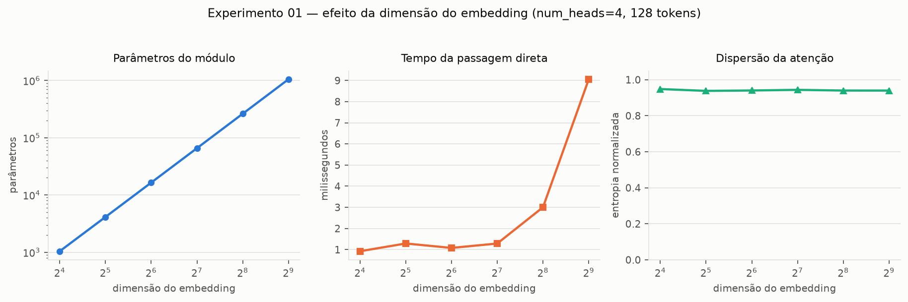

### 4.2 Número de cabeças (experimento 02)

`num_heads` de 1 a 16, com `d_out = 96` fixo. Como `head_dim = d_out // num_heads`, o orçamento de
96 dimensões é **repartido** entre as cabeças, não multiplicado.

| `num_heads` | `head_dim` | Parâmetros | Matrizes de atenção | Tempo (ms) | Entropia norm. | Dissimilaridade |
|---:|---:|---:|---:|---:|---:|---:|
| 1 | 96 | 36.960 | 8 | 0,69 | 0,942 | — |
| 2 | 48 | 36.960 | 16 | 0,97 | 0,942 | 0,444 |
| 4 | 24 | 36.960 | 32 | 1,15 | 0,941 | 0,437 |
| 8 | 12 | 36.960 | 64 | 2,42 | 0,941 | 0,432 |
| 12 | 8 | 36.960 | 96 | 4,31 | 0,941 | 0,428 |
| 16 | 6 | 36.960 | 128 | 6,41 | 0,942 | 0,426 |

**Multi-head não é um custo em parâmetros — é um custo em execução.** A contagem fica travada em
36.960 nas oito configurações. É o resultado mais contraintuitivo do experimento e vale entender por
quê: as matrizes `Wq`, `Wk` e `Wv` continuam sendo `96 × 96`; mudar `num_heads` só muda **como elas
são lidas** — em 1 bloco de 96 colunas ou em 16 blocos de 6. O tensor de pesos é o mesmo.

O que cresce é o número de matrizes de atenção calculadas, de 8 para 128, e com ele o tempo: 9,4
vezes mais lento de 1 para 16 cabeças. Em CPU, isso vem sobretudo do fato de que multiplicações
pequenas aproveitam mal o paralelismo — cada cabeça opera em apenas 6 dimensões quando `num_heads =
16`.

**As cabeças não são redundantes.** A dissimilaridade média entre pares fica estável em torno de
0,43 — bem longe de zero. Já na inicialização, cada cabeça distribui a atenção de um jeito próprio,
simplesmente porque cada bloco de colunas de `Wq` e `Wk` foi sorteado independentemente. É a
condição necessária para que o treinamento possa especializá-las: se partissem idênticas, receberiam
o mesmo gradiente e permaneceriam idênticas.

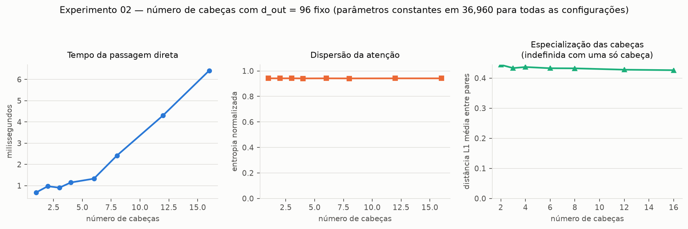

### 4.3 Dimensão da cabeça (experimento 03)

`head_dim` de 4 a 128, com `num_heads = 4` fixo — o caminho oposto ao do experimento 02: aqui `d_out`
cresce junto.

| `head_dim` | `d_out` | Parâmetros | Tempo (ms) | Entropia norm. |
|---:|---:|---:|---:|---:|
| 4 | 16 | 6.416 | 1,01 | 0,941 |
| 16 | 64 | 28.736 | 1,03 | 0,944 |
| 64 | 256 | 164.096 | 2,41 | 0,943 |
| 128 | 512 | 459.264 | 5,25 | 0,943 |

**Os dois experimentos isolam efeitos diferentes.** No 02, mais cabeças com o mesmo orçamento: os
parâmetros ficam constantes e o tempo cresce. No 03, cabeças maiores: os parâmetros crescem 72 vezes
e o tempo cresce 5. A comparação deixa claro que `num_heads` e `head_dim` não são intercambiáveis —
um reparte a capacidade, o outro a aumenta.

**A entropia continua imune.** De `head_dim = 4` a 128, permanece em 0,94. `head_dim` *é* o `d_k` do
divisor da escala: ele aparece nos dois lados da conta e se cancela. Terceira confirmação
independente do mesmo mecanismo.

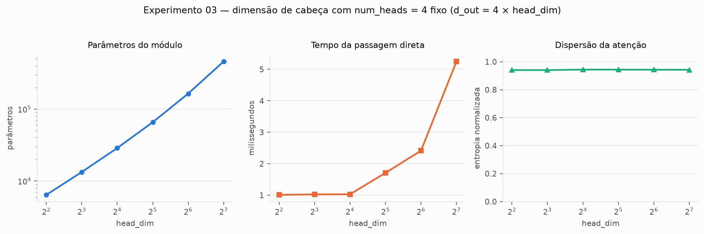

### 4.4 Self-Attention × Multi-Head Attention (experimento 04)

Cinco mecanismos, `d_in = d_out = 96`, 128 tokens, lote de 8.

| Mecanismo | Cabeças | Parâmetros | Causal | Tempo (ms) | Entropia norm. | Dissimilaridade |
|---|---:|---:|:---:|---:|---:|---:|
| `atencao_simples` | 1 | 0 | não | 0,32 | **≈ 0** | — |
| `SelfAttentionV2` | 1 | 27.648 | não | 0,46 | 0,954 | — |
| `CausalAttention` | 1 | 27.648 | sim | 0,66 | 0,942 | — |
| `MultiHeadAttentionWrapper` | 4 | 27.648 | sim | 1,79 | 0,941 | 0,433 |
| `MultiHeadAttention` | 4 | 36.960 | sim | 1,30 | 0,941 | 0,437 |

**A atenção simplificada colapsa em dimensões reais.** Entropia de `4,8 × 10⁻¹⁸` — na prática, zero:
cada token dirige praticamente toda a sua atenção a um único outro token. A razão é que
`atencao_simples` não tem escala: os scores são produtos escalares crus de embeddings de 96
dimensões, com desvio-padrão da ordem de 10, e o softmax satura. No exemplo de 3 dimensões do livro
isso não aparece — os scores ficam entre 0,3 e 1,5 e a distribuição sai bem espalhada (ver figura do
experimento 05). O mecanismo da seção 3.3 é didático; ele não sobrevive a dimensões realistas. Vale
registrar que o problema não é a ausência de pesos treináveis, e sim a ausência da escala — é o
mesmo fenômeno medido no experimento 06.

**A `out_proj` explica a diferença de parâmetros.** Os 9.312 parâmetros a mais da
`MultiHeadAttention` são exatamente `96 × 96 + 96`: a projeção de saída, que o wrapper não tem.

**As cabeças diferem entre si** (dissimilaridade ≈ 0,43), confirmando o experimento 02.

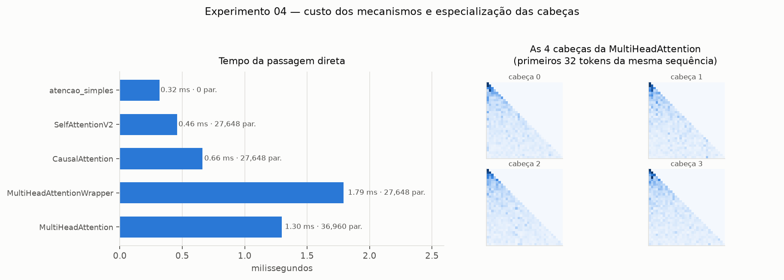

#### Empilhamento × divisão de pesos: a afirmação do livro, testada

A página 108 justifica a `MultiHeadAttention` assim: as projeções Q, K e V exigem **uma**
multiplicação de matriz cada, em vez de uma por cabeça, e esse é o passo mais caro. Medimos as duas
coisas separadamente, porque elas não respondem da mesma forma.

| Configuração | Projeção separada (ms) | Projeção única (ms) | Ganho | Forward wrapper (ms) | Forward MHA (ms) | Ganho |
|---|---:|---:|---:|---:|---:|---:|
| `d`=96, `h`=4, `n`=128 | 0,095 | 0,038 | **2,46×** | 1,29 | 0,84 | **1,54×** |
| `d`=192, `h`=4, `n`=128 | 0,182 | 0,100 | **1,82×** | 1,68 | 1,20 | **1,40×** |
| `d`=384, `h`=8, `n`=256 | 0,837 | 0,703 | **1,19×** | 7,96 | 10,01 | **0,80×** |
| `d`=768, `h`=12, `n`=256 | 4,72 | 3,21 | **1,47×** | 19,39 | 26,20 | **0,74×** |

**A afirmação do livro se confirma no passo que ela descreve.** Uma única camada `d × d` é sempre
mais rápida que `num_heads` camadas `d × head_dim`, de 1,2× a 2,5×, mesmo executando o mesmo número
de operações aritméticas. A economia é de *overhead*: uma chamada de kernel em vez de `num_heads`, e
um acesso contíguo à memória em vez de vários fragmentados.

**Mas no tempo total, em CPU e dimensões grandes, o wrapper vence.** A 768 dimensões a
`MultiHeadAttention` é 26% **mais lenta**. A comparação não é simétrica: ela executa ainda a
`out_proj` — uma multiplicação `768 × 768` aplicada a todos os tokens, comparável em custo a uma
projeção inteira de Q, K ou V — e reorganiza os tensores com `view`/`transpose`/`contiguous`, o que
envolve cópia de memória.

Ou seja: **a vantagem existe onde o livro diz que existe, mas não é o fator dominante no tempo total
nesta máquina.** A leitura correta é que a `MultiHeadAttention` compra eficiência nas projeções e
paga por ela na saída e na reorganização; o saldo depende do hardware e da escala. Em GPU, onde o
custo de lançar kernels é proporcionalmente muito maior e as transposições são baratas, o saldo
tende a favorecer a divisão de pesos — mas isso não foi medido aqui e não deve ser afirmado com base
nestes dados.

Nada disso muda a escolha de arquitetura: `out_proj` é parte do desenho do GPT, não um custo
evitável, e é a `MultiHeadAttention` que será integrada na Sprint 4.

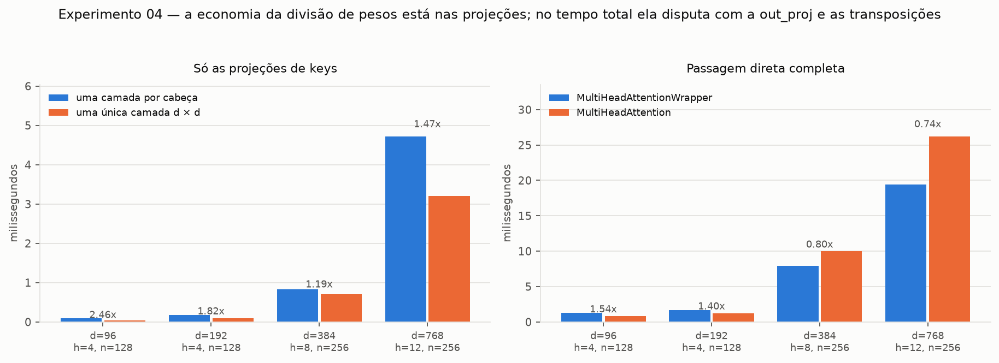

### 4.5 Visualização das matrizes de atenção (experimento 05)

Linhas são queries (quem olha), colunas são keys (quem é olhado), a cor é o peso, cada linha soma 1.

Sobre o exemplo de seis tokens do livro, os valores anotados reproduzem exatamente as páginas 77, 92
e 93 — inclusive a linha `[0,5517 · 0,4483 · 0 · 0 · 0 · 0]` da atenção causal. O contraste entre os
três painéis resume o capítulo: à esquerda a matriz simétrica da atenção sem pesos; no centro a
matriz assimétrica que `Wq` e `Wk` distintos tornam possível; à direita o triângulo superior apagado
pela máscara.

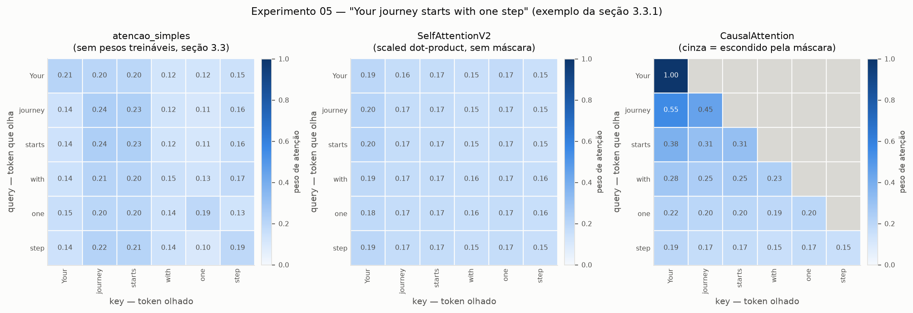

Sobre 24 tokens reais do corpus, e por cabeça, o quadro é outro. As quatro matrizes são visivelmente
distintas — é a dissimilaridade de 0,43 dos experimentos 02 e 04, agora em forma visual. Uma cabeça
concentra atenção nos tokens imediatamente anteriores, outra espalha mais uniformemente. Novamente:
esses padrões vêm da inicialização aleatória, não de aprendizado.

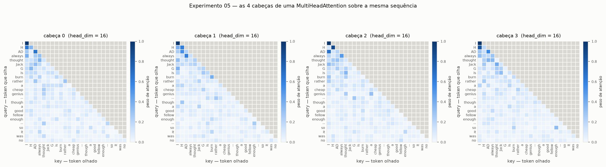

### 4.6 Com e sem escala (experimento 06)

`d_k` de 2 a 2048, `Q` e `K` sorteados de uma normal padrão, média de 10 sorteios por configuração.

| `d_k` | Escala | Desvio dos scores | Peso máximo médio | Entropia norm. | Sensibilidade do softmax |
|---:|---|---:|---:|---:|---:|
| 2 | com | 0,96 | 0,094 | 0,903 | 0,961 |
| 2 | sem | 1,35 | 0,150 | 0,830 | 0,930 |
| 32 | com | 1,00 | 0,107 | 0,887 | 0,961 |
| 32 | sem | 5,63 | 0,700 | 0,217 | 0,410 |
| 128 | com | 1,00 | 0,106 | 0,888 | 0,962 |
| 128 | sem | 11,28 | 0,859 | 0,091 | 0,200 |
| 512 | com | 1,01 | 0,107 | 0,885 | 0,961 |
| 512 | sem | 22,87 | 0,929 | 0,043 | 0,102 |
| 2048 | com | 1,00 | 0,107 | 0,887 | 0,962 |
| 2048 | sem | 45,37 | 0,971 | 0,018 | 0,043 |

A cadeia causal aparece inteira nas colunas, e é exatamente a descrita na página 84.

**Primeiro elo — a variância.** Sem escala, o desvio-padrão dos scores é 1,35 → 45,37: cresce como
`√d_k` (√2 ≈ 1,4; √2048 ≈ 45,3; os valores medidos batem). Com escala, fica preso em 1,00 nas seis
dimensões. É a definição do fator: dividir por `√d_k` cancela exatamente o crescimento que o produto
escalar introduz.

**Segundo elo — a saturação.** Scores com desvio 45 fazem o softmax se comportar como uma função
degrau: o peso máximo médio por linha chega a 0,971, ou seja, um único token recebe 97% da atenção
e os outros 63 dividem 3%. A entropia normalizada cai de 0,83 para 0,018 — a distribuição deixa de
ser uma distribuição.

**Terceiro elo — o gradiente.** Este é o que importa para o treinamento. A sensibilidade do softmax
(o traço de sua jacobiana, `Σⱼ pⱼ(1 − pⱼ)`) mede quanto gradiente ele deixa passar. Sem escala, cai
de 0,93 para **0,043** — uma redução de 22 vezes. Com escala, permanece em 0,96 do início ao fim.

Um softmax saturado é quase uma função constante: perturbar o score não muda o peso, logo a derivada
é praticamente nula, logo `Wq` e `Wk` recebem gradiente praticamente nulo e param de aprender. Como
o GPT-2 opera com `head_dim = 64` e modelos maiores vão muito além, o problema não é hipotético.

Vale notar a forma da curva: em `d_k = 2` a diferença entre com e sem escala é quase irrelevante
(0,930 contra 0,961). O fator só passa a importar conforme a dimensão cresce — o que explica por que
ele é fácil de omitir em exemplos pequenos e fatal em modelos reais.

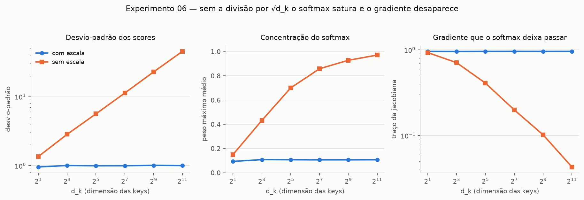

### 4.7 Comportamento da máscara causal (experimento 07)

Sobre 24 tokens reais, com `d_in = d_out = 64`.

**As duas estratégias do livro são idênticas.** Zerar depois do softmax e renormalizar (fig. 3.20)
contra preencher com `-inf` antes do softmax (fig. 3.21): maior diferença de `5,96 × 10⁻⁸` — ruído
de ponto flutuante. A segunda é preferível por fazer em um passo o que a primeira faz em três.

**A normalização sobrevive à máscara.** Soma das linhas: mínimo 1,000000, máximo 1,000000. Maior
peso acima da diagonal: exatamente `0,0`. Como `e^{-∞} = 0`, o softmax já exclui as posições
mascaradas do denominador.

**Não há vazamento de informação.** O teste decisivo não é olhar a matriz, é perturbar a entrada.
Somando 50 ao embedding do token 12:

| | Contextos anteriores ao token 12 | Contextos do token 12 em diante |
|---|---:|---:|
| **Com máscara** | `0,00` | `5,58 × 10¹` |
| **Sem máscara** | `5,57 × 10¹` | `5,57 × 10¹` |

Zero **exato**, não "pequeno". Uma perturbação enorme em um token futuro não move nem o último bit
dos vetores de contexto anteriores. Sem a máscara, o mesmo token contamina a sequência inteira. É
essa propriedade que torna o treinamento autorregressivo possível: sem ela, o modelo aprenderia a ler
a resposta em vez de prevê-la.

**A máscara concentra as primeiras posições.** O peso máximo por linha cai de 1,00 (posição 0, que só
se vê a si mesma) para 0,55 (posição 1), 0,48 (posição 2) e estabiliza em torno de 0,15 depois da
posição 15. Não é um comportamento aprendido — é aritmética: a posição *i* divide sua atenção entre
`i + 1` posições, e com poucas opções a distribuição é forçadamente concentrada. A entropia média
cai de 0,935 sem máscara para 0,919 com máscara, uma diferença pequena justamente porque só as
primeiras linhas são afetadas.

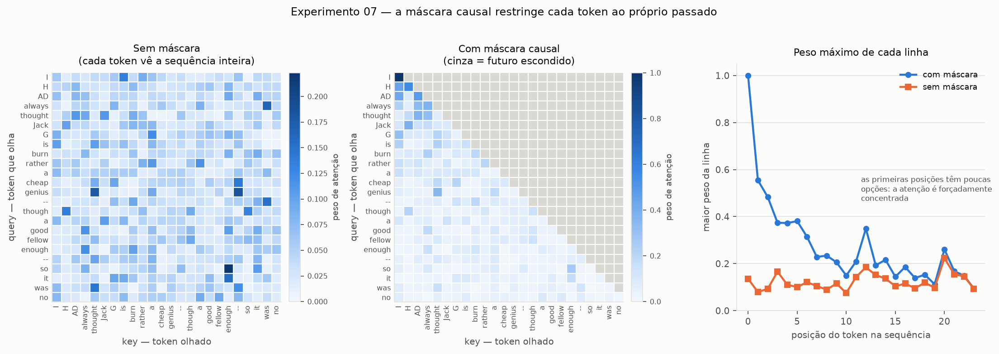
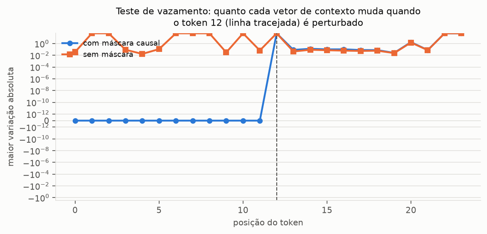

**Dropout.** Aplicado sobre os pesos já normalizados, em modo de treino:

| Taxa | Fração de pesos zerados | Soma média das linhas | Peso máximo |
|---:|---:|---:|---:|
| 0,0 | 0,000 | 1,000 | 1,00 |
| 0,1 | 0,100 | 1,010 | 1,11 |
| 0,2 | 0,223 | 0,984 | 1,25 |
| 0,5 | 0,503 | 0,999 | 2,00 |

A fração zerada acompanha a taxa, como esperado. O peso máximo é exatamente `1/(1 − p)` — 1,11, 1,25,
2,00 — que é o fator de reescalonamento aplicado aos sobreviventes. E a soma das linhas **deixa de
ser exatamente 1**, oscilando em torno dela: o dropout preserva a *esperança* da saída, não a soma de
cada linha individual. Em `eval()` o dropout é desativado e as linhas voltam a somar 1 exatamente.

### 4.8 Diferentes sequências de entrada (experimento 08)

#### (a) Conteúdo

| Sequência | Tokens | Entropia norm. | Atenção ao 1º token | Atenção ao próprio token |
|---|---:|---:|---:|---:|
| exemplo do livro | 7 | 0,887 | 0,232 | 0,290 |
| narrativa (corpus) | 27 | 0,905 | 0,114 | 0,112 |
| diálogo (corpus) | 25 | 0,926 | 0,119 | 0,117 |
| token repetido | 21 | 0,932 | 0,141 | 0,131 |
| **token repetido (sem posicional)** | 21 | **0,991** | 0,127 | 0,135 |
| tokens sem relação | 19 | 0,887 | 0,139 | 0,129 |
| pontuação pesada | 19 | 0,912 | 0,150 | 0,139 |

**O resultado central é o par de linhas do token repetido.** A mesma sequência — vinte cópias de
`"the"` — passada duas vezes pelo mesmo módulo, com e sem o embedding posicional da Sprint 2:

- **com** posicional: entropia 0,932, com variação visível entre as linhas;
- **sem** posicional: entropia **0,991**, praticamente 1 — cada linha é uniforme sobre o próprio
  passado.

A explicação é direta. Sem o vetor de posição, todos os vinte tokens têm embeddings **idênticos**.
Logo todas as queries são iguais, todas as keys são iguais, todos os scores são iguais, e o softmax
de valores iguais é a distribuição uniforme. O único desvio de 1,000 vem da máscara: a primeira linha
tem uma só posição visível.

Isso demonstra uma propriedade do mecanismo que o capítulo não mede explicitamente: **a atenção, por
si só, é invariante a permutações**. Ela não tem noção alguma de ordem — o produto escalar entre
query e key não sabe quem veio antes. Toda a informação de ordem em um Transformer entra pelos
embeddings posicionais da Sprint 2 (e, parcialmente, pela máscara causal, que ao menos distingue
passado de futuro). Sem eles, *"o gato mordeu o cão"* e *"o cão mordeu o gato"* produziriam
exatamente o mesmo conjunto de vetores de contexto.

As demais sequências diferem pouco entre si (entropia de 0,887 a 0,926), o que é coerente com a
ressalva metodológica: com pesos aleatórios, o mecanismo ainda não tem motivo para tratar pontuação
diferente de narrativa. Essa é uma comparação a refazer depois do treinamento da Sprint 5.

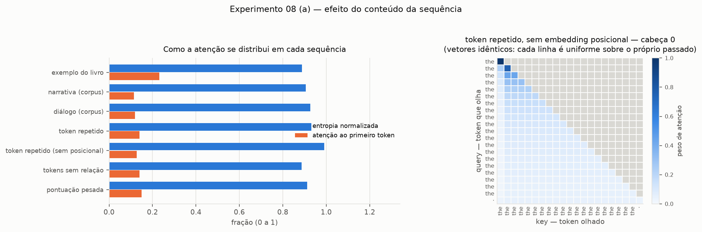

#### (b) Comprimento

| Tokens | Elementos da matriz | Tempo (ms) | Tempo por token (µs) | Entropia norm. | Atenção ao 1º token |
|---:|---:|---:|---:|---:|---:|
| 8 | 2.048 | 0,31 | 4,91 | 0,875 | 0,248 |
| 16 | 8.192 | 0,47 | 3,69 | 0,899 | 0,160 |
| 32 | 32.768 | 0,40 | 1,58 | 0,914 | 0,097 |
| 64 | 131.072 | 0,56 | 1,10 | 0,928 | 0,059 |
| 128 | 524.288 | 0,93 | 0,91 | 0,940 | 0,034 |
| 256 | 2.097.152 | 6,70 | 3,27 | 0,949 | 0,020 |

**O custo quadrático.** A matriz de atenção cresce com `num_tokens²`: 8 → 256 tokens multiplica o
comprimento por 32 e os elementos da matriz por 1.024. É a razão de fundo pela qual aumentar a janela
de contexto de um LLM é caro — o GPT-2 pequeno, com 1024 tokens de contexto, mantém 12 matrizes de
1024 × 1024 por sequência do lote.

O tempo por token cai até 128 tokens (4,91 → 0,91 µs) e depois **sobe** para 3,27 µs em 256. A queda
inicial é diluição de overhead: em sequências curtas o custo fixo domina. A subida em 256 é o termo
quadrático começando a pesar mais do que a diluição compensa — ponto em que os dados disponíveis não
permitem separar o efeito algorítmico de efeitos de cache, e portanto não se deve afirmar mais do que
isso.

**A atenção ao primeiro token cai com `1/n`** (0,248 → 0,020, um fator 12,6 para uma variação de 32
no comprimento). Também é aritmética, não comportamento: com pesos aleatórios a atenção é
aproximadamente uniforme, e a fração média que cabe a qualquer token fixo diminui conforme há mais
tokens para dividir.

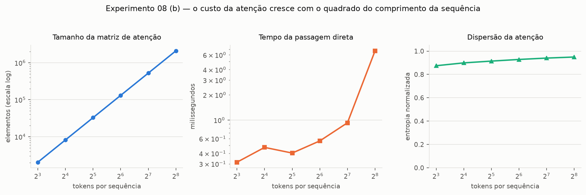

---

## 5. Síntese

O que os experimentos estabelecem, em ordem de importância:

1. **A escala `1/√d_k` não é um detalhe de ajuste fino.** Sem ela, em `d_k = 2048`, o softmax entrega
   97% da atenção a um único token e deixa passar 22 vezes menos gradiente. O experimento 04 mostra
   o mesmo colapso acontecendo na atenção simplificada da seção 3.3 assim que ela sai do exemplo de
   3 dimensões do livro.
2. **A máscara causal funciona de forma exata, não aproximada.** Perturbação de magnitude 50 em um
   token futuro produz variação `0,00` — zero de ponto flutuante — nos contextos anteriores.
3. **Multi-head é gratuito em parâmetros e caro em execução.** Com `d_out` fixo, 1 ou 16 cabeças
   usam os mesmos 36.960 parâmetros; o tempo cresce 9,4 vezes. O que se compra com isso são cabeças
   genuinamente diferentes entre si (dissimilaridade ≈ 0,43), que é a condição para que o
   treinamento possa especializá-las.
4. **A afirmação de eficiência da página 108 vale para o passo que ela descreve, mas não domina o
   tempo total nesta máquina.** A projeção única é 1,2× a 2,5× mais rápida que as projeções
   separadas; no forward completo, a `out_proj` e as transposições invertem o saldo em dimensões
   grandes.
5. **A atenção é cega à ordem.** A sequência de token repetido sem embedding posicional produz
   entropia 0,991 — atenção uniforme —, porque vetores idênticos geram scores idênticos. A noção de
   ordem no Transformer vem inteiramente dos embeddings posicionais da Sprint 2.

---

## 6. Limitações e próximos passos

**Limitações.**

- Nenhum módulo foi treinado. Todas as observações descrevem o mecanismo, não o que ele aprende. As
  matrizes de atenção mostradas refletem inicialização aleatória.
- As medidas de tempo são de CPU, de uma única máquina, e variam entre execuções. Servem para
  comparação relativa, não como caracterização de desempenho.
- A comparação entre sequências de conteúdos diferentes (experimento 08a) tem pouco poder de
  discriminação antes do treinamento — é um ponto de partida para refazer na Sprint 5.
- A conclusão sobre empilhamento × divisão de pesos vale para esta configuração de CPU; o
  comportamento em GPU não foi medido.

**Próximos passos (Sprint 4).**

A `MultiHeadAttention` é a classe a ser integrada ao bloco Transformer, ao lado de layer
normalization, rede feed-forward e conexões residuais. Duas coisas já estão preparadas para isso: a
assinatura do `forward` devolve apenas os vetores de contexto por padrão, e a máscara é um buffer,
de modo que o módulo acompanha `.to(device)` sem ajuste manual.

---

## 7. Entregáveis da Sprint 3

| Entregável | Onde |
|---|---|
| Glossário do Capítulo 3 | [`technical-glossary/capitulo-03.md`](../technical-glossary/capitulo-03.md) |
| Self-Attention | `atencao_simples`, `SelfAttentionV1` em [`src/attention.py`](../src/attention.py) |
| Scaled Dot-Product Attention | `scaled_dot_product_attention`, `SelfAttentionV2` |
| Causal Attention | `CausalAttention` |
| Multi-Head Attention | `MultiHeadAttentionWrapper`, `MultiHeadAttention` |
| Experimentos | [`experiments/sprint03-atencao/`](../experiments/sprint03-atencao/) |
| Visualizações das matrizes | `exp05-*.png` em [`results-by-sprints/sprint03/`](../results-by-sprints/sprint03/) |
| Análise dos resultados | este relatório |
| Código organizado | `src/`, `notebook/`, `experiments/`, `results-by-sprints/` |
| Quiz individual | avaliação individual, aplicada pelo componente curricular |

---

## Referência

RASCHKA, Sebastian. **Build a Large Language Model (From Scratch)**. Manning Publications.
Capítulo 3 — *Coding Attention Mechanisms*.
